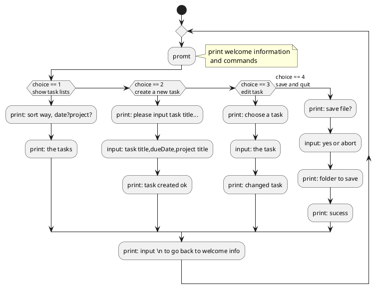

### flow chart for ToDoly

```plantuml
@startuml

start
repeat

:promt; 
note right: print welcome information\n and commands
if (choice == 1\nshow task lists) 

:print: sort way, date?project?;
:print: the tasks;


else if (choice == 2\ncreate a new task) 

:print: please input task title...;
:input: task title,dueDate,project title;
:print: task created ok;

else if (choice == 3\nedit task)

:print: choose a task;
:input: the task;
:print: changed task;


else (choice == 4\nsave and quit)

:print: save file?;
:input: yes or abort;
:print: folder to save;
:print: sucess;


endif

:print: input \\n to go back to welcome info;

@enduml
```