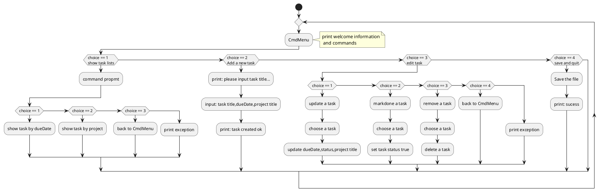

### flow chart for ToDoly

```plantuml
@startuml

start
repeat

:CmdMenu; 
note right: print welcome information\n and commands
if (choice == 1\nshow task lists) 


:command propmt;
if (choice == 1)
:show task by dueDate;
else if (choice == 2)
:show task by project;
else if (choice == 3)
:back to CmdMenu;
else 
:print exception;
endif


else if (choice == 2\nAdd a new task) 

:print: please input task title...;
:input: task title,dueDate,project title;
:print: task created ok;

else if (choice == 3\nedit task)
if (choice == 1)
:update a task;
:choose a task;
:update dueDate,status,project title;
else if (choice == 2)
:markdone a task;
:choose a task;
:set task status true;

else if (choice == 3)
:remove a task;
:choose a task;
:delete a task;
else if (choice == 4)
:back to CmdMenu;
else 
:print exception;
endif


else if(choice == 4\nsave and quit)

:Save the file;
:print: sucess;

else


endif


@enduml
```