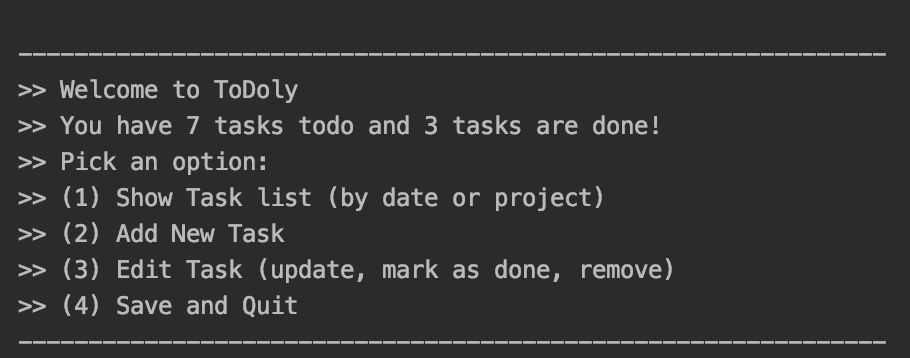
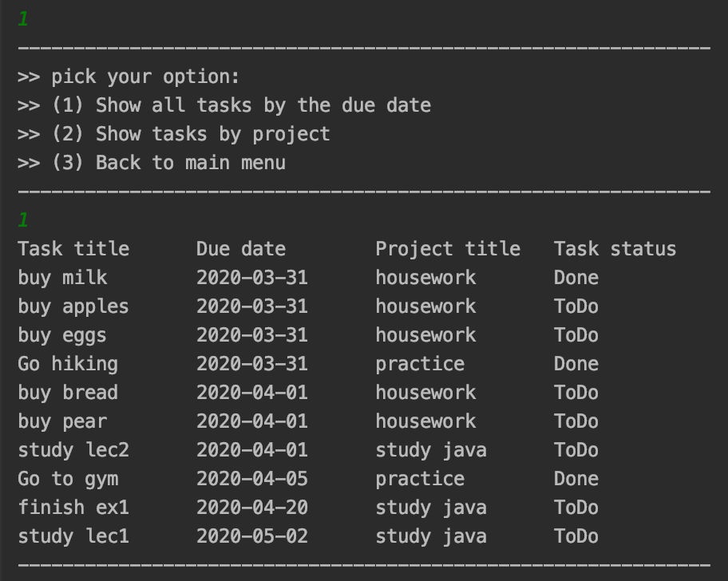
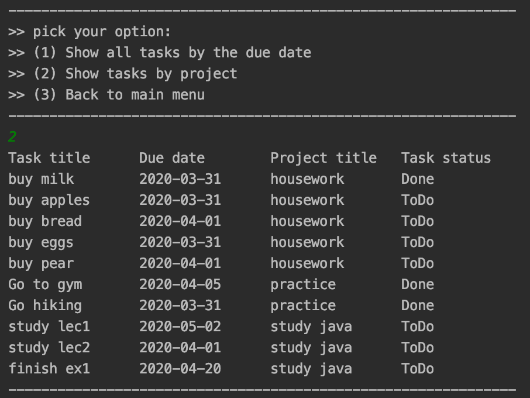
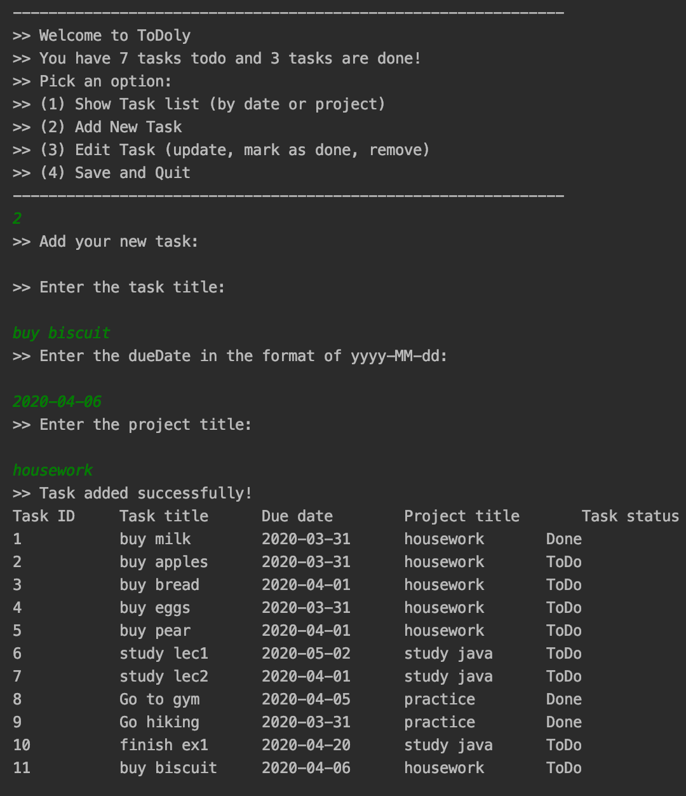
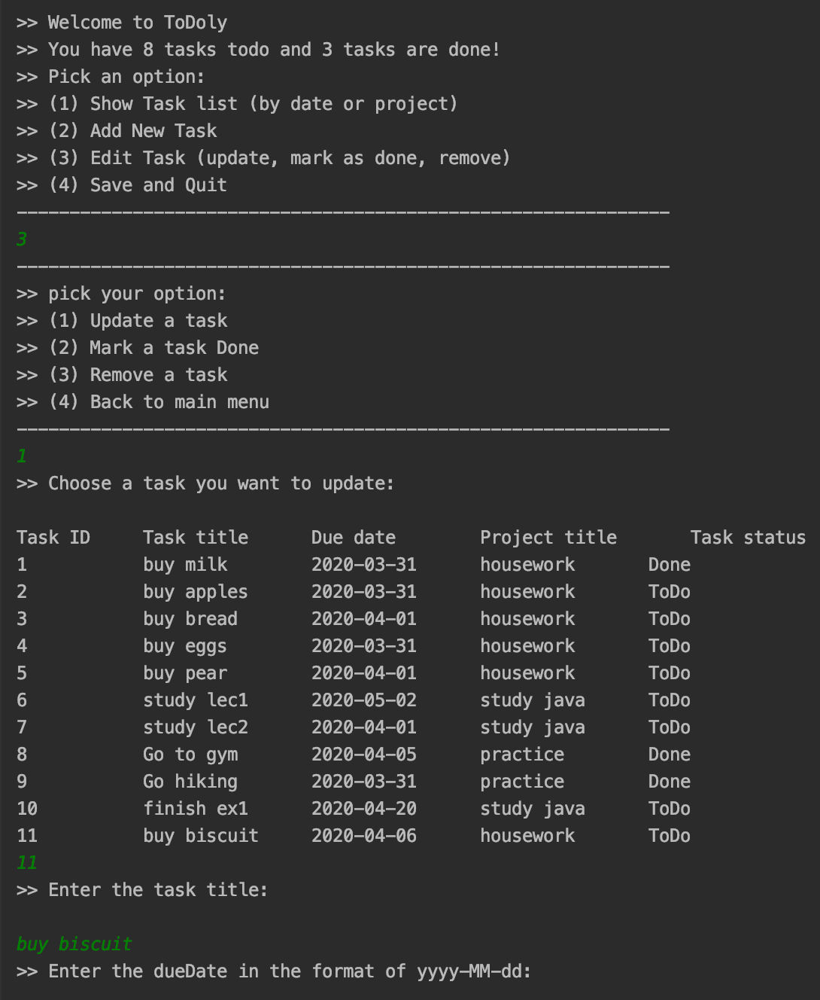
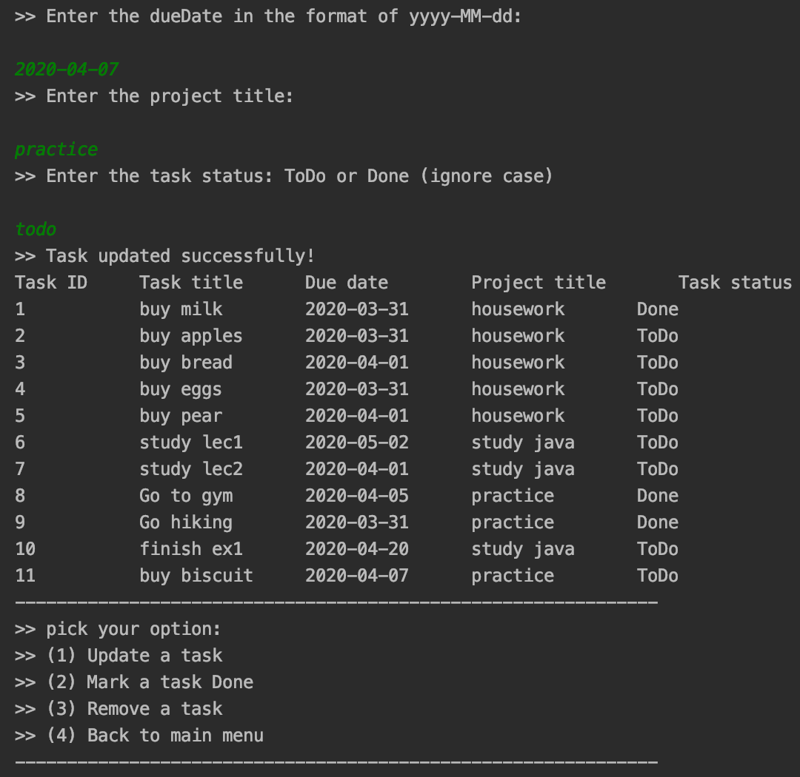
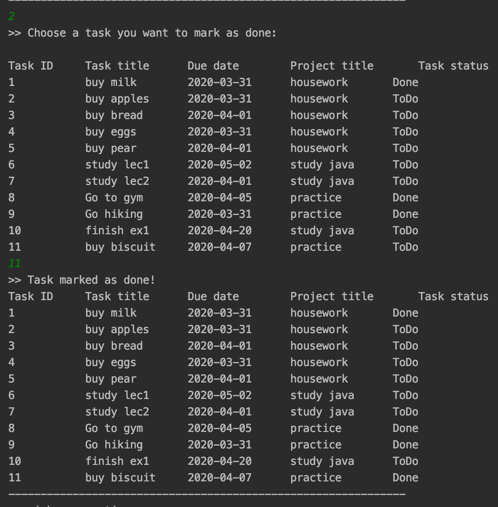
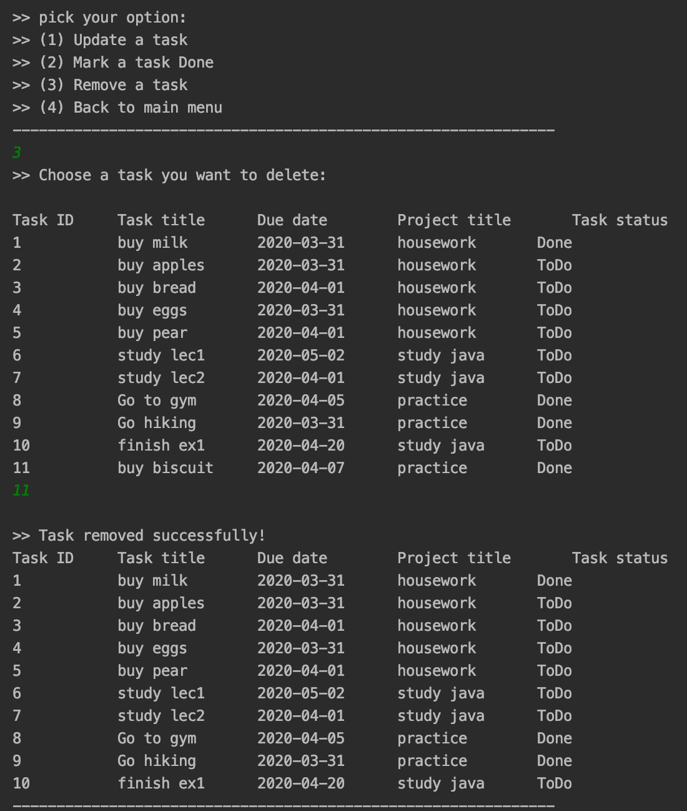
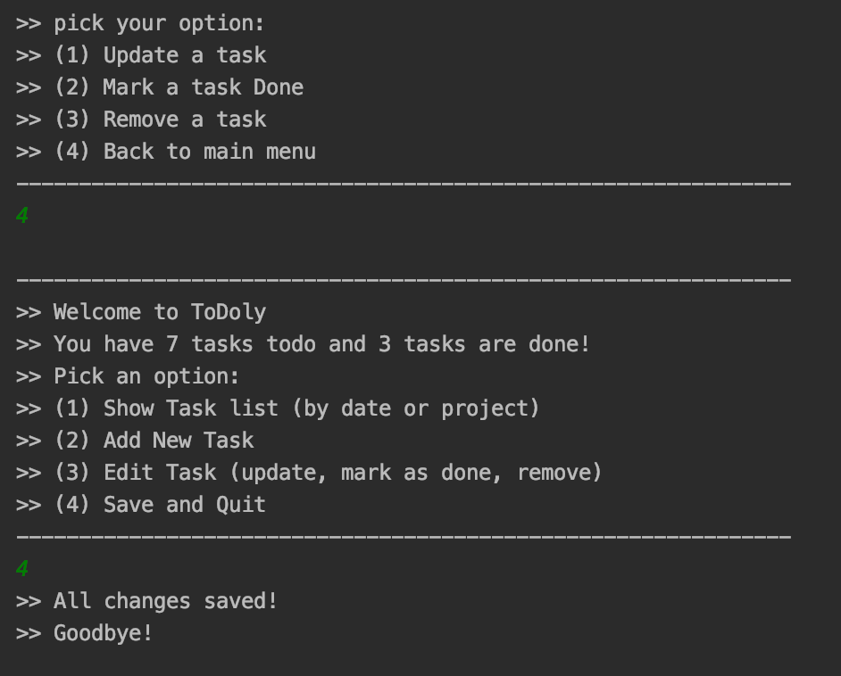

## User Manual  

This document provides a brief introduction to the CML application ToDolyApp. By import the project to IntelliJ IDEA and run ToDolyApp.java (or by compile java files in terminal or run java -jar ip-1.0.jar ). The welcome interface or the main menu of the application provides 4 options for a user and it looks as the image show in 0.  

**0. The main menu of the application**   
 
 

 **1. Show task list**  
In the first option, it allows to display the tasks by date or by project groups.   

    
   
        

**2. Add a new task**  

   

**3. Edit task**  

   
   

   

   

**4. Save and quit the application**   

   